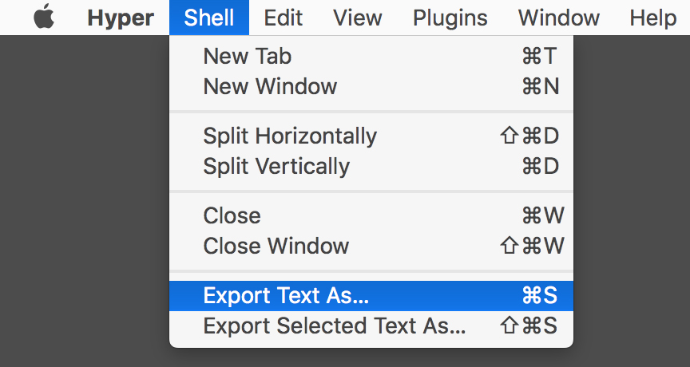
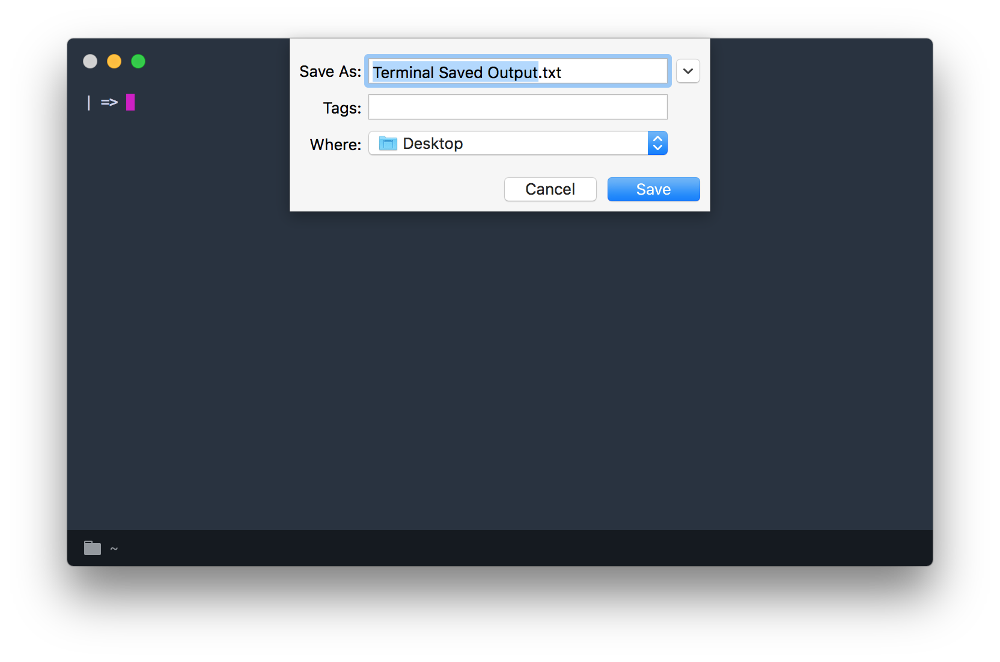

# hyper-savetext

[](https://travis-ci.org/neil-orans/hyper-savetext) [](https://badge.fury.io/js/hyper-savetext)

**hyper-savetext is a text export plugin for [Hyper](https://hyper.is/)**. It enables you to save/export text within the terminal to a text file. The feel and functionality of the plugin has been modeled after the same feature within macOS's Terminal.app. Currently, Hyper has been tested on macOS, Linux, and Windows with the stable version of Hyper 1.4.8, 2.1.1, and 3.0.2.

<p align="center">


</p>

## Install

#### Using Hyper's CLI

```
hyper install hyper-savetext
```

#### Manually

To install, edit `~/.hyper.js` and add `"hyper-savetext"` to `plugins`:

```
plugins: [
  "hyper-savetext",
  // other plugins...
],
```

## Using the plugin

You have the option to save all the text in the terminal or just the selection. The save button is under Hyper's 'Shell' menu on macOS, and the 'File' menu on Window and Linux. Saving can also be done through the keybindings Cmd-S (Ctrl for Windows/Linux) or Cmd-Shift-S, which corresponds to saving all the terminal text or just the current selection, respectively.

## Contributing

Feel free to contribute to hyper-savetext by [requesting a feature](https://github.com/neil-orans/hyper-savetext/issues/new), [submitting a bug](https://github.com/neil-orans/hyper-savetext/issues/new) or contributing code.

To set up the project for development:

1.  Clone the repo to `~/.hyper_plugins/local/hyper-savetext`
2.  Add this to your `.hyper.js`:

```js
  localPlugins: [
    // local plugins...
    'hyper-savetext'
  ],
```

3.  Reload terminal window

## Authors

* Neil Orans [@neil-orans](https://github.com/neil-orans)
* Nick Morrison [@NicholasMorrison](https://github.com/nicholasmorrison)

## Credit

Originally suggested by [@mhamdan95](https://github.com/mhamdan95) as a [plugin request](https://github.com/zeit/hyper/issues/2693) on Hyper's issue tracker.

## Theme

* [hyper-chesterish](https://github.com/henrikdahl/hyper-chesterish)

## License

[MIT](LICENSE.md)

[](https://github.com/prettier/prettier)
